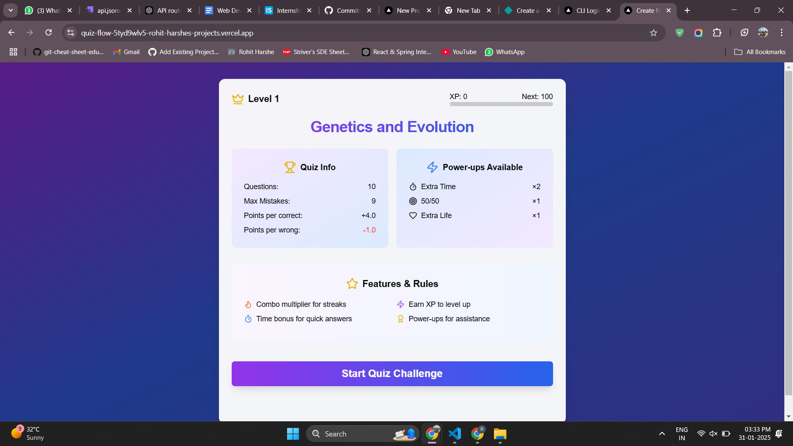
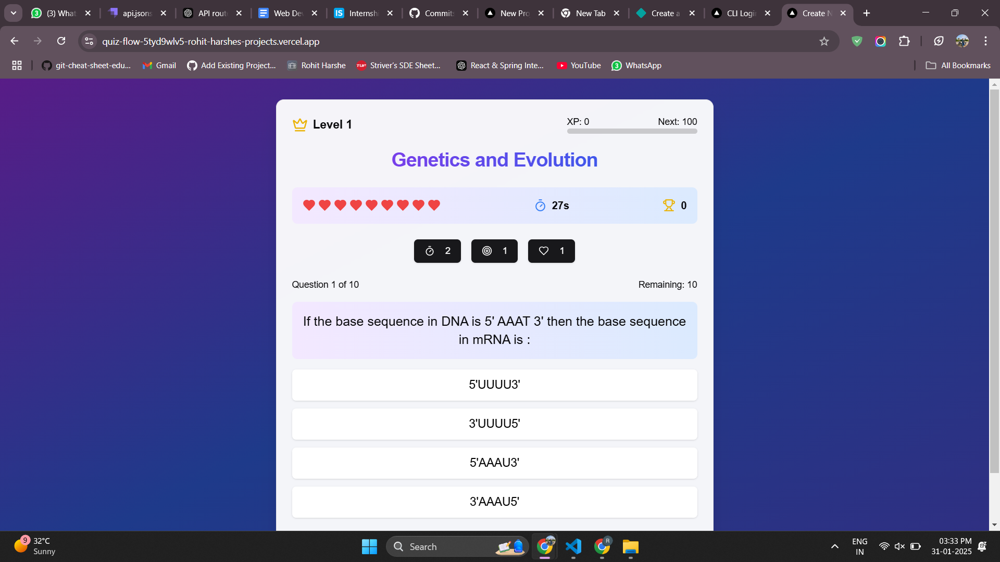
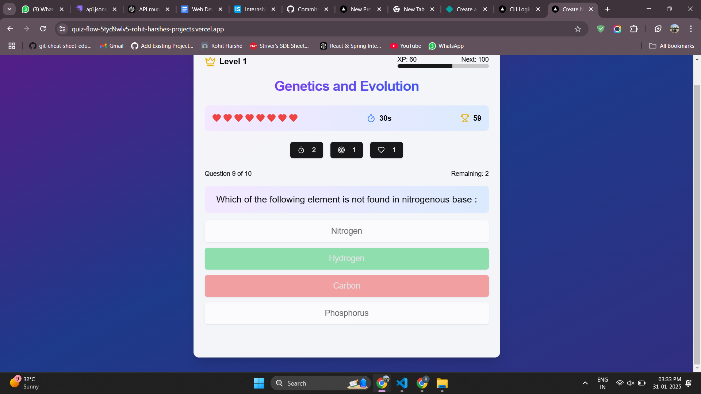
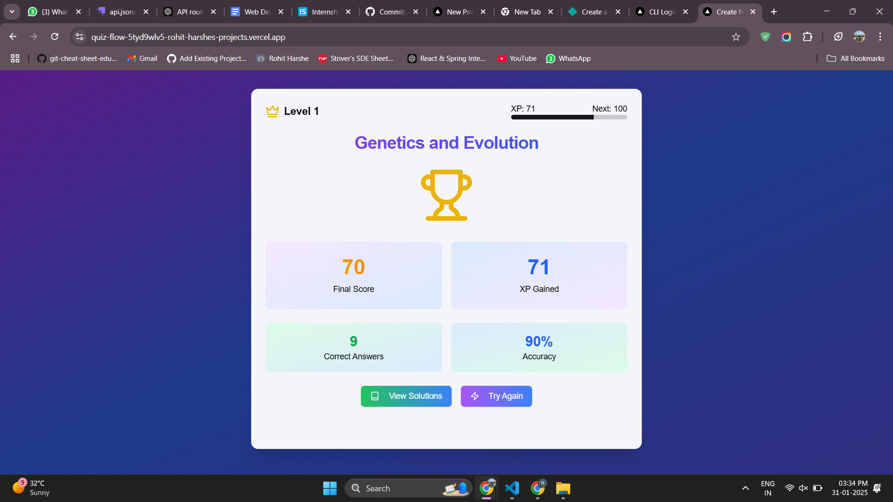
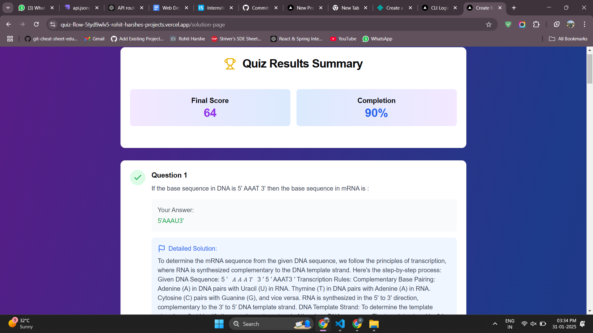

## Quiz Flow
A simple quiz app built with Next.js.

🔗 **Live Demo:** [Quiz Flow](https://quiz-flow-5tyd9wlv5-rohit-harshes-projects.vercel.app/)


## Installation & Setup

1. Clone the repository:
   ```sh
   git clone https://github.com/Rohit-0987/quize-flow.git
   cd quize-flow
2. Install dependencies:
    ```sh
    npm install
3. Run the development server:
    ```sh
    npm run dev
    Open http://localhost:3000 in your browser.


#### **📌 Screenshots & Video Walkthrough**
- 
  ```markdown
  ## Screenshots
  
  
  
  
  

🎥 **Video Walkthrough:** [Watch Here](https://www.awesomescreenshot.com/video/36106116?key=29b1f4d2425b8815662fa6d5a4695b9d)


#### **📌 Screenshots**
Home Page 

Quiz Page

Quiz answer

Quiz result

Quiz Detailed Solution

